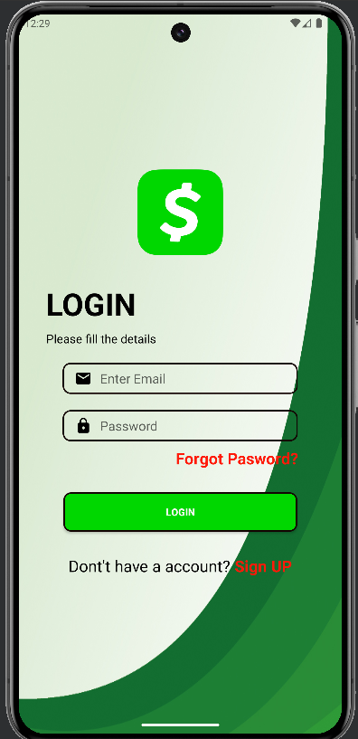
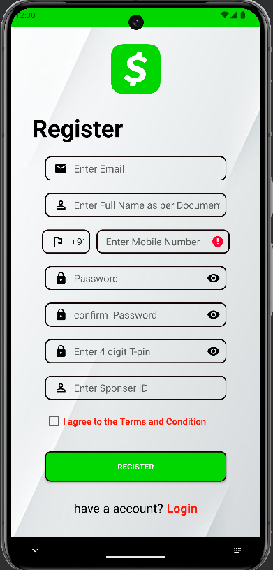
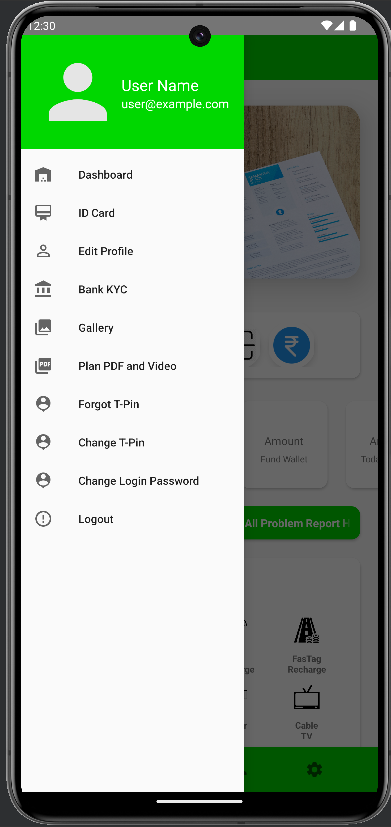
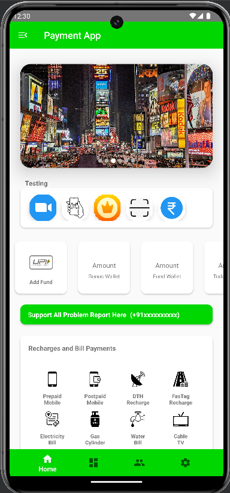
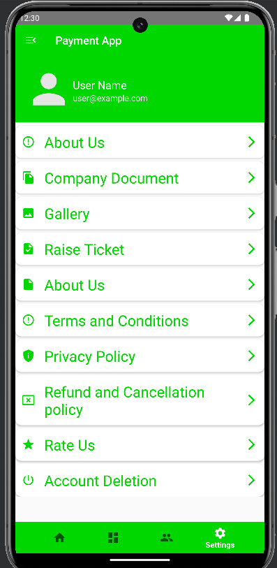

# Payment APP

Payment Application front-end design

## Features

- Front-End design of a Payment App
- Intuitive design

## Screenshots

Include some screenshots of your app in action.






## Installation
Clone the project and run apk

### Prerequisites

- Android Studio
- Minimum SDK version: Android 7
- Target SDK version: Android 14

### Steps

1. Clone the repository:
    ```bash
    git clone https://github.com/eren8204/paymentapp.git
    ```
2. Open the project in Android Studio.
3. Build and run the project on your emulator or Android device.

## Usage

This is just a front-end design

## Contact
If you have any questions, feel free to reach out to me at apskumar24@gmail.com.

## Acknowledgments

- [Android SDP](https://github.com/intuit/sdp) - Helped in managing app on different screen sizes
- [ImageSlider](https://github.com/denzcoskun/ImageSlideshow) - Helped in adding automatic image slider
